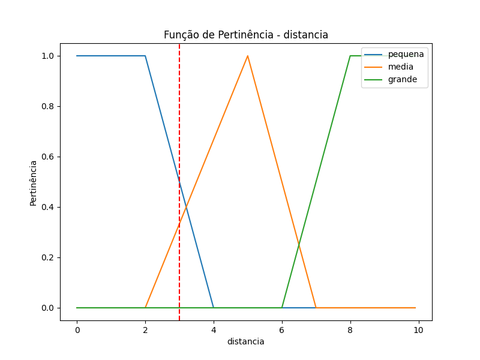
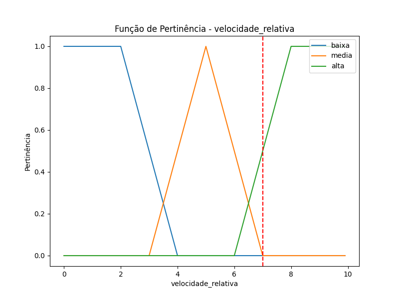
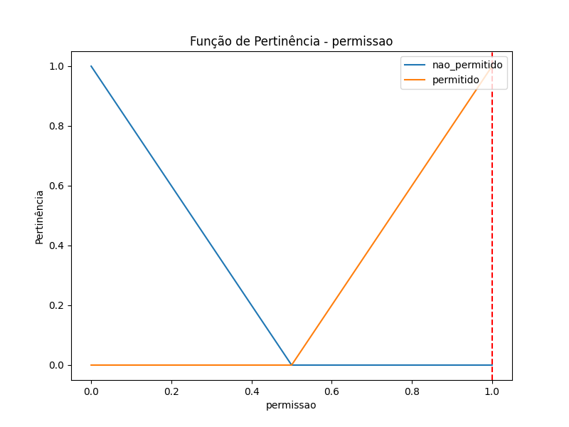
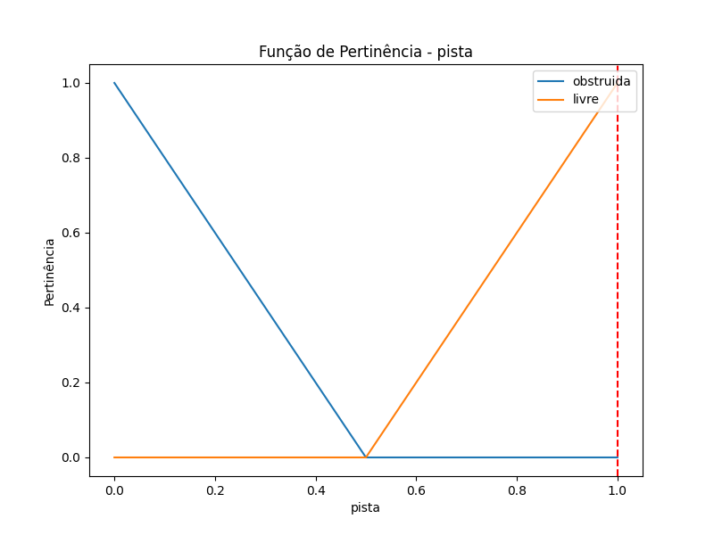
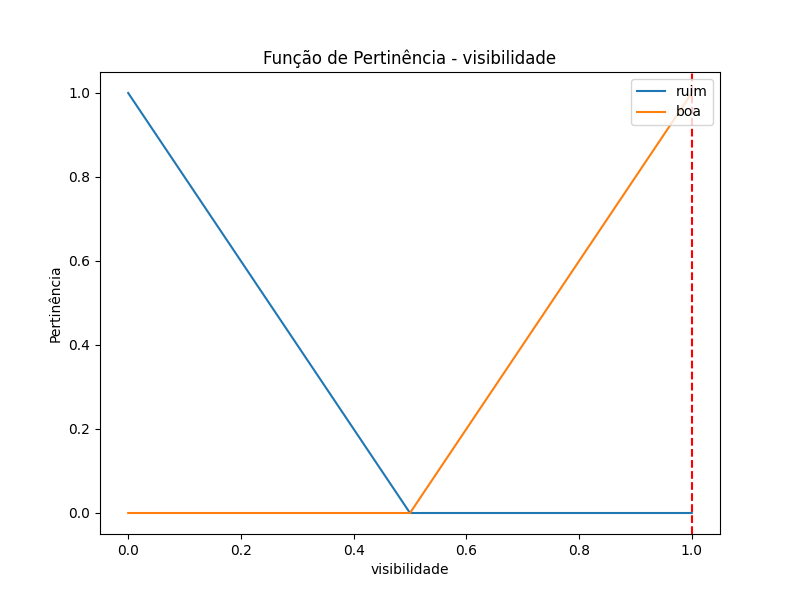

# Trabalho de Computação Inteligente - Sistema de Controle de Ultrapassagem

## Descrição do Sistema de Inferência Nebulosa (SIN)

Este projeto implementa um **Sistema de Inferência Nebulosa (SIN)** para controlar o momento ideal para realizar uma ultrapassagem de um veículo autônomo. O sistema considera variáveis como **distância**, **velocidade relativa**, **condições da pista**, **visibilidade**, e **permissão de ultrapassagem**.

### Variáveis de Inferência:
1. **distancia_adequada (da)**: Avalia se a distância até o veículo à frente é adequada para a ultrapassagem.
2. **permissao_ultrapassagem (pu)**: Indica se o trecho da estrada permite ultrapassagem, conforme a legislação de trânsito.
3. **pista_livre (pl)**: Verifica se a pista contrária está livre de veículos ou obstáculos.
4. **velocidade_veiculo_frente (vvf)**: Determina se a velocidade do veículo à frente é adequada para realizar a ultrapassagem.
5. **visibilidade (v)**: Avalia se o trecho da estrada apresenta boas condições de visibilidade.

### Variáveis Linguísticas:
A seguir estão as variáveis linguísticas utilizadas para o controle de ultrapassagem.

#### Tabela 1 - Variável **distancia_adequada (da)**

| Termo  | Representação | Intervalo numérico |
|--------|---------------|--------------------|
| Baixa  | B             | [0, ..., 5]        |
| Média  | M             | [3, ..., 7]        |
| Alta   | A             | [5, ..., 10]       |

#### Tabela 2 - Variável **permissao_ultrapassagem (pu)**

| Termo      | Representação |
|------------|---------------|
| Negada     | N             |
| Permitida  | P             |

#### Tabela 3 - Variável **pista_livre (pl)**

| Termo      | Representação |
|------------|---------------|
| Livre      | L             |
| Obstruída  | O             |

#### Tabela 4 - Variável **velocidade_veiculo_frente (vvf)**

| Termo      | Representação | Intervalo numérico |
|------------|---------------|--------------------|
| Lenta      | L             | [0, ..., 5]        |
| Adequada   | A             | [3, ..., 7]        |
| Rápida     | R             | [5, ..., 10]       |

#### Tabela 5 - Variável **visibilidade (v)**

| Termo  | Representação |
|--------|---------------|
| Ruim   | R             |
| Boa    | B             |

### Regras de Inferência:

1. **SE** a **distância** é **baixa** (B) **E** a **pista** está **livre** (L) **E** a **visibilidade** é **boa** (B) **E** a **velocidade do veículo à frente** é **adequada** (A), **ENTÃO** a **ultrapassagem** é **permitida** (P).
   
2. **SE** a **distância** é **média** (M) **E** a **pista** está **livre** (L) **E** a **visibilidade** é **boa** (B) **E** a **velocidade do veículo à frente** é **adequada** (A), **ENTÃO** a **ultrapassagem** é **permitida** (P).
   
3. **SE** a **distância** é **alta** (A) **OU** a **pista** está **obstruída** (O) **OU** a **visibilidade** é **ruim** (R) **OU** a **velocidade do veículo à frente** é **lenta** (L), **ENTÃO** a **ultrapassagem** é **negada** (N).
   
4. **SE** a **distância** é **baixa** (B) **E** a **pista** está **livre** (L) **E** a **visibilidade** é **boa** (B) **E** a **velocidade do veículo à frente** é **rápida** (R), **ENTÃO** a **ultrapassagem** é **negada** (N).

---

## Gráficos das Funções de Pertinência

Abaixo estão os gráficos gerados para as variáveis linguísticas do sistema. Eles foram gerados como arquivos PNG e salvos automaticamente.

### 1. Função de Pertinência para **Distância Adequada (da)**



### 2. Função de Pertinência para **Velocidade do Veículo à Frente (vvf)**



### 3. Função de Pertinência para **Permissão de Ultrapassagem (pu)**



### 4. Função de Pertinência para **Pista Livre (pl)**



### 5. Função de Pertinência para **Visibilidade (v)**



---

## Instalação e Execução

### Passo 1: Clonar o Repositório
Primeiro, clone o repositório contendo o código do projeto:

```bash
git clone https://github.com/IMNascimento/SIN.git
```

### Passo 2: Configurar o Ambiente Virtual
Crie e ative um ambiente virtual para isolar as dependências do projeto.

```bash
# Para Linux/MacOS
python3 -m venv venv
source venv/bin/activate

# Para Windows
python -m venv venv
venv\Scripts\activate
```

### Passo 3: Instalar Dependências
Instale todas as dependências necessárias executando o seguinte comando:

```bash
pip install -r requirements.txt
```

### Passo 4: Executar o Código
Para rodar o projeto, execute o arquivo main.py que realiza a simulação e gera os gráficos PNG automaticamente:

```bash
python main.py
```

Após a execução, os gráficos serão salvos no diretório atual com nomes como distancia_fuzzy_plot.png, velocidade_relativa_fuzzy_plot.png, etc.

### Explicação:

1. **Tabelas de Pertinência**: O Markdown inclui tabelas para descrever os termos linguísticos e seus intervalos.
2. **Gráficos**: As imagens são referenciadas como PNGs gerados pelo código.
3. **Instruções de Instalação e Execução**: Inclui passos detalhados para clonar, configurar o ambiente virtual, instalar dependências e executar o código.
4. **Regras de Inferência**: As regras fuzzy são descritas de maneira clara para entender o processo de decisão.